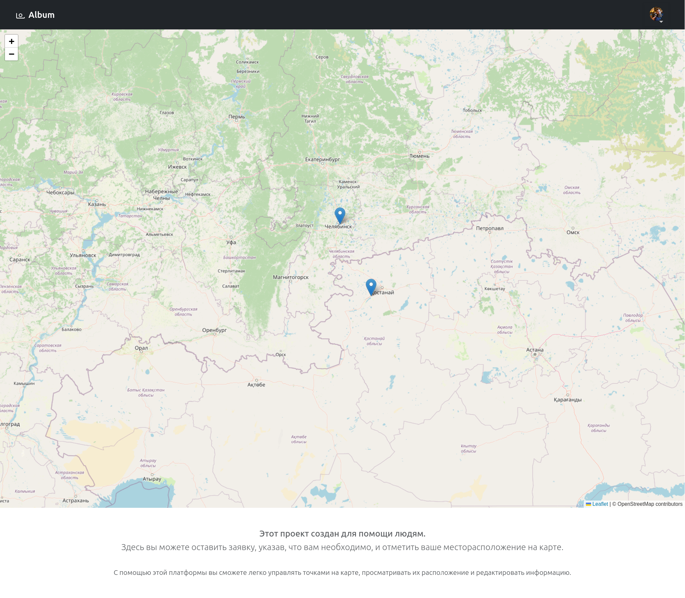
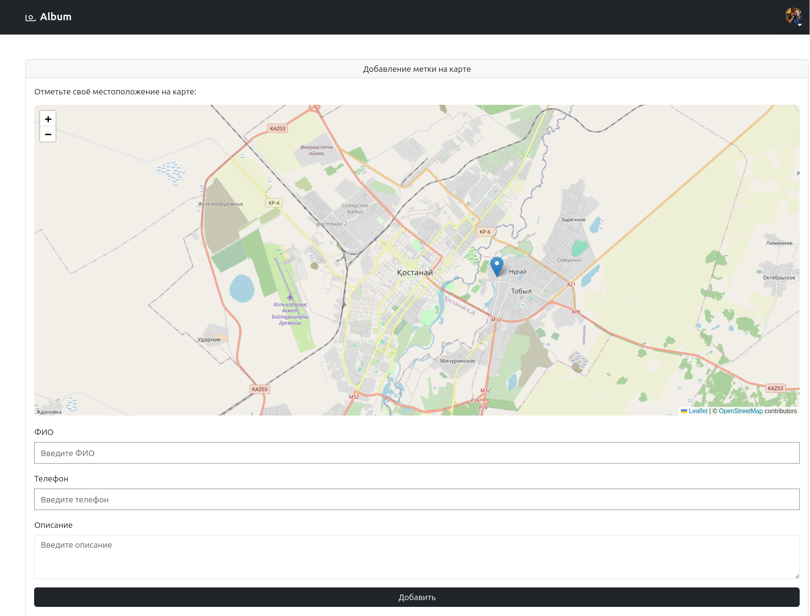
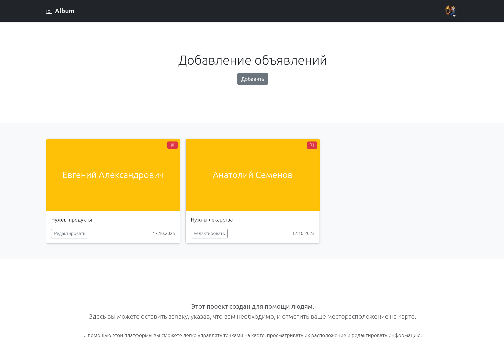
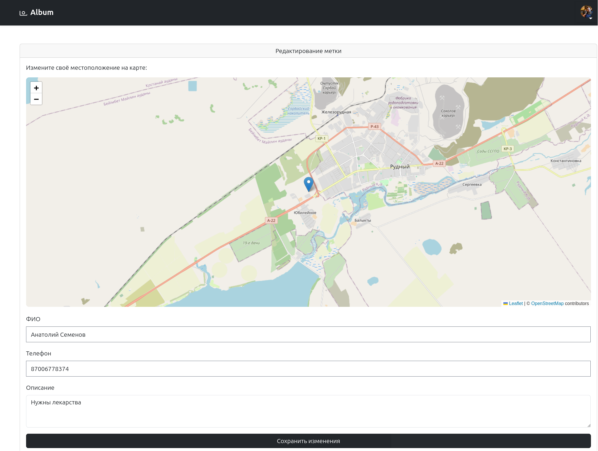

# О проекте

**Help Map** — это проект, созданный для помощи людям.  
Он позволяет оставлять заявки с описанием необходимой помощи и указывать своё местоположение на карте.

## Возможности:
- Создание заявок с нужной информацией
- Отображение точек на карте
- Редактирование и управление заявками
- Просмотр актуальных данных в удобном интерфейсе

С помощью **Help Map** вы сможете быстро находить нужные точки, управлять ими и помогать тем, кто рядом.

# Настройка

Запуск
```bash
docker compose up -d
```

Устанавливаем зависимости
```bash
docker compose run composer install
docker compose run node npm install
```

Настройка конфига .env
```bash
cp src/.env.example src/.env
```
> Настроить .env под себя

Ключ и миграции
```bash
docker compose run artisan key:generate
docker compose run artisan migrate
```

# Скриншоты






